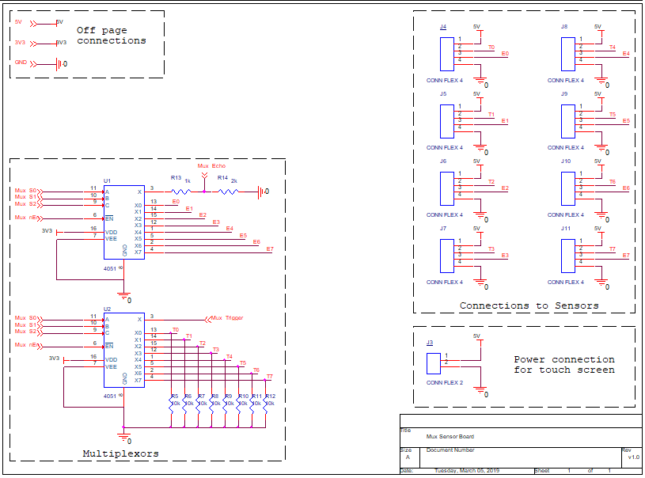
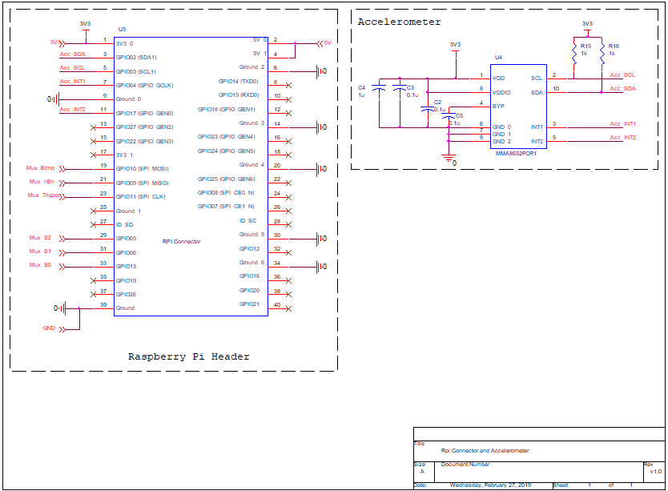

# Raspberry Pi Shield PCB

This PCB is placed upon the raspberry pi as a shield and contains:
- Headers to connect the ultrasonic sensors to the pi
- An accelerometer

## Active Components Used
- MMA8652FCR1 Accelerometer
- 2x CD4051 Multiplexor

## Schematic

